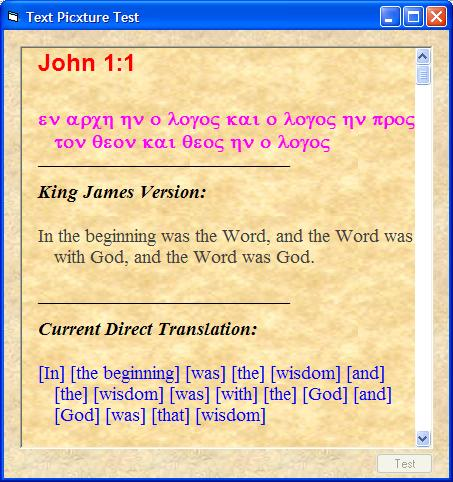



## clsTextPic \- Display formatted text on tiled image backgrounds

### Description

This class was designed to help someone create a formatted text (rich-text-like) display featuring tiled image backgrounds that was smooth and fast. Though someone can easily create a custom control from this, I did not need for it to go that far. Features: Any font style and size and color supported, indenting, hanging indents, smooth scrolling, single or tiled background image, and more. It was too useful to keep just to myself.
 
### More Info
 

             |
---                |---
**Submitted On**   |2004-10-31 12:38:08
**By**             |[David Ross Goben](https://github.com/Planet-Source-Code/PSCIndex/blob/master/ByAuthor/david-ross-goben.md)
**Level**          |Intermediate
**User Rating**    |4.8 (24 globes from 5 users)
**Compatibility**  |VB 6\.0
**Category**       |[VB function enhancement](https://github.com/Planet-Source-Code/PSCIndex/blob/master/ByCategory/vb-function-enhancement__1-25.md)
**World**          |[Visual Basic](https://github.com/Planet-Source-Code/PSCIndex/blob/master/ByWorld/visual-basic.md)
**Archive File**   |[clsTextPic18124610312004\.zip](https://github.com/Planet-Source-Code/david-ross-goben-clstextpic-display-formatted-text-on-tiled-image-backgrounds__1-57019/archive/master.zip)

